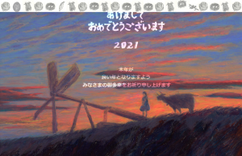

---
title: "2021年賀状用画像を作り始めました"
date: 2020-08-03 22:49:42
category: "文化・芸術"
---

2021年の干支は丑（牛）ですね。

前回の丑年では、風の谷のナウシカの毛長牛とチャルカの絵をフォトショを使って描きましたが。

今回は、せっかく油絵を始めたので油絵を描いて、それをスキャンして画像にするつもりでネタ探し。

　

すると、天空の城ラピュタに、実は「毛長牛」ちゃんがワンショット出ていたことに気づきました。

（たぶん故郷にいた時代のシータとその飼牛）

（印刷前の画像データです）

　

スキャナ～プリンタの能力もあるのでしょうが、「空」が思った色身になってくれませんでした。

ハガキの印刷結果では、空の部分が、この画面以上に、ぺったりとペンキを塗ったような状態でした。

原画は、紫とオペラピンクが上塗りしてあるのですが、青とオレンジが妙に目立ち、凡々とした色身に。

この失敗の原因を押さえておかないと、来年また同じ過ちを繰り返すことになると考え、各段階での劣化原因を調べてみました。

　

・スキャン

ここで読み込まれなかった色は、フォトショップで補正のやりようがありません。

確認してみると、

かなり再現性は高い。

ただし、

最後に「薄塗り」した層、空の薄紫（バイオレットグレイ＋マゼンダ＋希釈）や人物の影（インジゴ＋希釈）は「飛ばされ」下地色が読み込まれた。

それと、（ある程度予想はしていましたが）オペラピンクの再現性の悪さ。蛍光系はやはりスキャンには弱い。（蛍光色は、「人が眼で視た時に」鮮やかになる顔料成分）

　

・プリンタ（Canon TS5030）

フォトショップで補正のやりようがある部分です。

確認してみると、

画像データ上にあった細かなグラデーションや色味が、かなりの部分で飛んで無くなってしまっていました。

「印刷モード」を合わせきれなかった可能性があります。（←通常は、ここまで含めて強制的にフォトショで修正するのですが）

近年のプリンタは、デジカメなどで撮影した画像なら、かなり「上手に補正して」印刷してくれます。

今回の場合、これらのグラデーションが、これらの「自動補正」によって（望まない悪い方向へ）調整されてしまったようです。

　

これら２段階の返還によって、「ピンク～紫」の階調の”つもり”だった空の部分が、「オレンジ～青」の組み合わせになってしまった、と判断しました。

これらを回避するためには、

①（読み込まれやすい）厚めに塗る「下地」色の色選びを重視

②蛍光色に頼らない色味づくり

これらで、スキャンとプリント劣化に負けないようにしていきたいです。

　

　　

おまけ：絵の具

【インジゴ】異常に乾燥しにくい絵の具でした。2日経っても触っちゃったときに擦れてショックorz

【コバルトターコイズ】～SFじゃないやつ～廃色になったのはなぜ？ビビットじゃないところが良くて、すげえいい色なのに。近似色を買ってみたけど、なんか違うんです。なので、在庫で持ってる残りのチューブは、虎の子です。

【オペラ】今回は、このピンクが大活躍。バーミリオンではいかにも朱色ってところを和らげてくれました。あとはスキャン＆プリントしてもこの色味が残るかが問題。昔の印刷機だとオペラピンクって蛍光系は、原稿色が表現できなかったんですよ。今はどうかな？～オペラ純色の再現性は低かったです。

【ホリゾンブルー】空色は何色も買ったんですが、最終的にはこれをベース色にしました。【バイオレットグレイ】と迷ったんですが、紫雲との色味差をつけるためだけに。でもどうしても空色系は安っぽくなりがち。バチターなんかもう使う機会ないんじゃないかな。次回空表現をする機会にはもうちょっと考えたいです。

【バイオレットグレイ】そのままだと安っぽい色になりますが、下地色や混色次第でいい感じになりそう。今回の「紫雲」のベース色にもなっています。

【カーマイン】茜色は低層雲の主色に。

こうしてみるとオペラといいカーマインといい、FSSの影響が残ってるわ～。でも雲にこの色を使えたのは結構思い切れた、と自己満足してます。

　

