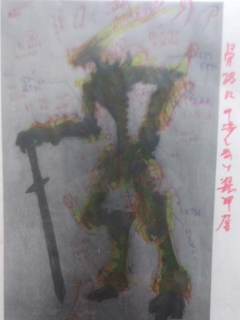

---
title: "2023年賀状用画像が完成"
date: 2022-12-15 00:00:00
category: "文化・芸術"
---

・あけましておめでとうございます(2023.01.01)

兎に見える様にとかいう基本的なところから、お互いの装甲パーツが干渉し合わないようにとかの細かいところまで考えてはいます。

最終的には、FSS的な形状でありかつ半透明装甲（ガラスのうさぎ）、加えて大和の古式な鎧（因幡の白兎）もイメージしました。

　

年賀状という締め切りが無いと、延々と色を乗せ続けそうでした。

