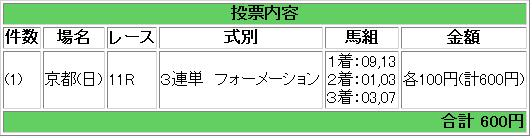

---
title: "2013/11/10エリザベス女王杯展望 ３"
date: 2013-11-10 09:12:27
category: "ギャンブル"
---

さて、当日になってしまいました。

Ｇ１で当日この時間まで予想が掛けないというのは珍しいのですが、たいがい当日予想の日は当たらないと自分で分かっています。

要は迷いがある、ということです。

　

さて、買い目は以下のとおり。

 

　

内枠に入ってしまった③メイショウマンボを落としました。

過去１０年に遡って、内枠に入った秋華賞馬を調べましたが、先日も書いたとおり、やはり大きな崩れはないものの２着～掲示板というパターンでした。

一方⑨ヴィルシーナの死に枠ですが、前目に行くということで枠の不利は消せると見ました。

一発ならやはり⑬レインボーダリア。☆マークがこの馬程似合う馬も他にはいないでしょう。

　

３着ヒモ付けですが、これも良くて５人気まで。となると⑤⑦⑭からの選択となります。

⑤ホエールキャプチャは、東京以外で買う気はないので、消去法で⑦となりました。

　

さてどうか。

 

（結果）

外しました

　

<a href="https://nyargo1971.github.io/nyargos-blog/">ブログトップ</a> | <a href="http://www4.tokai.or.jp/nyargo/html/ano19.html">エクセルで競馬</a> | <a href="http://www4.tokai.or.jp/nyargo/">本家WEBサイト</a>

