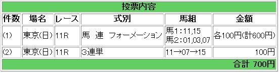

---
title: "2014/02/23フェブラリーS展望２"
date: 2014-02-22 21:45:53
category: "ギャンブル"
---

さて、フェブラリーS前日夜です。

オッズもだいぶ固まってきています。

フェブラリーSでは無理な穴狙いは禁物と考えています。数少ないＪＲＡダートＧ１の一つ。今年も有力馬がひしめいているわけで、連対にはそれなりの実績が必要です。

あるとすれば、ヒモ穴狙いでしょうか。

ちなみに３着は、過去１０年ほとんど逃げ先行馬で占められています。

というわけで馬券はこちら。

 

予想と少し離れてしまった部分もありますが、それは、オッズを加味したためです。

３着のヒモにぴったりの馬が見つからなかったため、無理なＦ買いは止めました。（小倉１１Ｒか東京１０Ｒにまわすと思います。）

　

（結果）

外しました

　

<a href="https://nyargo1971.github.io/nyargos-blog/">ブログトップ</a> | <a href="http://www4.tokai.or.jp/nyargo/html/ano19.html">エクセルで競馬</a> | <a href="http://www4.tokai.or.jp/nyargo/">本家WEBサイト</a>

