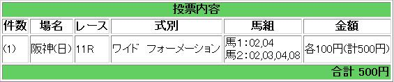

---
title: "2014/04/06 中山ダービー卿CT 展望２"
date: 2014-04-05 23:19:14
category: "ギャンブル"
---

（結果）

外しました。orz

　

ただしなぜかPAT残高はプラス…。予想と関係ないところで当たってどうする

　

（４月６日追補）

◎ ④レッドアリオン

○ ⑪トリップ

▲ ⑯カオスモス

　

データ的には⑯カオスモスと⑦プリムラブルガリスが生き残ったのですが、⑯は大外枠で、本命にするには危険すぎますし、⑦は下記のとおりオッズに「？」が付きます。

このため、休み明けは×というデータを無視して、上記３頭を選び直しました。

　

オッズと前走データ

過去データを単勝オッズ順に並べ替えてみると、次のような傾向がありました。

まず、単勝１０倍以上は全て６番人気以下となっています。

そして、ポイントとなるのが、単勝２０倍以上。

単勝２０倍以上の穴馬の前走が、東風Ｓ組率が以上に高いのです。

東風Ｓ組：６頭

その他組：３頭

つまり、大穴は東風Ｓ組有利ということです。

１～５番人気＋東風Ｓ組という組み合わせに馬券妙味アリと判断し、最初に書いたとおりの印を付けました。

　

（以下元の記事）

 

　

<a href="https://nyargo1971.github.io/nyargos-blog/">ブログトップ</a> | <a href="http://www4.tokai.or.jp/nyargo/html/ano19.html">エクセルで競馬</a> | <a href="http://www4.tokai.or.jp/nyargo/">本家WEBサイト</a>

