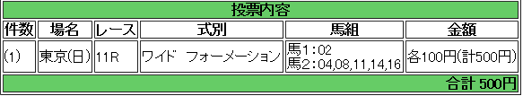

---
title: "2014/06/22　函館SS ユニコーンS 展望"
date: 2014-06-15 22:21:27
category: "ギャンブル"
---

(結果)

外しました。

&nbsp;

以下記事

6月22日(日)は勤務シフトが入っているため、競馬ができません。

逆にちょうどよかったかも…

というのも、サマースプリント第1戦の函館スプリントＳもユンコーンも大穴とは縁が遠いレースだからです。

&nbsp;

■函館SS

(買い目)

  ②アジアエクスプレスの人気には逆らいません。

&nbsp;

(予想)

◎ ②アジアエクスプレス

○ ⑧ルミニズム

△④⑪⑭⑯

&nbsp;

データ的には前走連対していないアジアエクスプレスは危険な人気が漂っていますが、それでもこのレースは人気馬が来るレースなので、人気には逆らわず買います。

⑧ルミニズムはちょっと無理狙い（500万下勝ちが1400ｍはデータ上イマイチ）ですが、連穴ならこの馬かなと思っています。

&nbsp;

(データ)

人気馬。

ヒモ荒れはあるかもしれません。

連対はほぼ1～3人気。

ダートのオープン勝ちか、1600～1800m500万下勝ち上がりが必須です。

1400m勝ちは人気でもこけている傾向があります。

&nbsp;

(土曜日・補記)

今年は上記条件に当てはまる馬が危険な人気馬となっている可能性があるため補記します。

ユニコーンは東京開催のため、次の条件がかなりの確率で当てはまります。

・近4走で、1，2番手の上がりの脚を使っていない馬は、切り

・芝戦以外では前走連対

以上のデータがありますのでご注意ください。

&nbsp;

かなり絞り込めることもあって配当妙味はありません。

