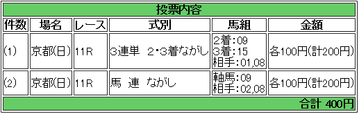

---
title: "2015/01/04 中山金杯・京都金杯　展望"
date: 2014-12-28 21:41:49
category: "ギャンブル"
---

●結果

外しました orz

&nbsp;

●買い目

（１）中山金杯

たぶん購入は中山金杯のほうにすると思うので、こちらは参考程度。

というのも、中山金杯を選ぶというのには至極個人的な理由があって、コノレース、岩田騎手が得意としています。

岩田騎手買わない縛りの私は馬券を外す可能性が高いため、中山金杯をチョイスしますが、実際には、ヒモに２桁人気が結構来る京都金杯の方が、馬券的妙味はあると思います。

&nbsp;

・ポイント

マイル経験がなくてもＯＫです。

ハンデ５２ｋｇ相当以下は来ていません。

&nbsp;

・穴馬のポイント

２種類あります。

（１）Ｇ１連対相当の格があるけれど近２走馬券に連対していない（不調の格上馬）

（２）近２走でオープン以下勝利の格下馬

特にヒモでは積極的に狙ってみたいところです。

