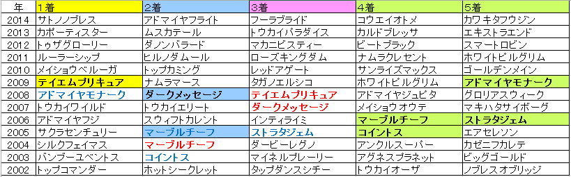

---
title: "2015/01/18 日経新春杯　展望"
date: 2015-01-12 17:20:51
category: "ギャンブル"
---

■結果

外しました　orz

■買い目

   過去何年かのリピーター具合を調べてみました。

いるにはいますが、さほど気にしなくてもよさそう。

特に、昨年１着馬が馬券に絡んでいないのが怖いです。

サトノノブレス…。私は切っちゃいます。

&nbsp;

・人気馬の脚質について

逃げ馬の⑦タマモベストプレイがそこそこ人気しているので、過去データを調べてみました。

下のリストのとおり、そもそも近年の「人気馬」に、生粋の逃げ馬はほとんどなっていません。逃げ馬自体は出走しているので、あまり人気にならないということでしょうか。

脚質：馬券内-馬券外

逃：0-1

先：4-4

中：9-4

差：5-5

追：0-1

このことから、過去何年も人気の逃げ馬が馬券に絡んでいない点は、そもそもデータに合致する馬がいなかったからで、消しデータというより、未知数。

人気が落ちなければ押さえておくつもりです。

&nbsp;

・枠順傾向について

枠順データを見ると、過去１３番枠より外で馬券になった馬が極端に少ないように見えます。

そう、今年気になるのが、⑱トウシンモンステラ。

データ的にはなかなかいいんです。人気筋としては信頼できる「前走馬券内」「上がりの脚がある」という条件を兼ね備えています。

&nbsp;

そこで、馬番ではなく、純粋に枠順データを取り直してみました。（２０００年以降）

１枠：６回

２枠：４回

３枠：５回

４枠：７回

５枠：５回

６枠：６回

７枠：７回

８枠：５回

枠の場合、さほど差が見られません。

過去の日経新春杯は、出走頭数が少ない年が多いため、見かけ上、外の馬番枠不利にみえる可能性があったと判断します。

