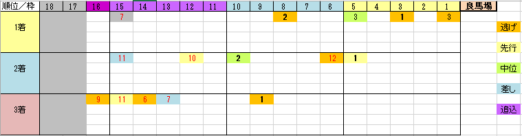

---
title: "2015/03/07（土） オーシャンＳ 展望"
date: 2015-03-02 13:38:48
category: "ギャンブル"
---

■結果

外しました

&nbsp;

■買い目

２００６年から始まった比較的若いレースです。

なお、上記データは「良馬場」だけのものです。

※道悪になったらデータ取り直します。

（土曜朝追記）

たぶん午後には馬場が回復するとは思うのですが念のため稍重のままだった場合も想定して穴傾向を追記します。

稍重以下の馬場では、内側の中位の穴馬が、大した差し足なくなだれこむ傾向があります。また、牝馬が多く登場します。

※以下の傾向も良馬場前提だとお考えください。

&nbsp;

・穴は外枠から

見事なくらいに、穴は外に偏っています。

脚質も、前か差しかで、極端な方がよさそうです。

&nbsp;

・人気馬の傾向

１～３人気に絞られています。

今年がどうなるかは別にして、人気と穴が極端な珍しい傾向です。

さらに、人気馬は２つのパターンに分かれました。

（１）Ｇ１連対相当の格

マイル戦等でも構いませんが、とにかくＧ１連対かＧ２勝ちの実績のある馬

（２）中山芝１２００ｍ勝ち経験

中山芝スプリント戦（オープン・条件戦）で勝利経験がある馬

&nbsp;

・穴馬の傾向

「逃げ」か「外枠」

