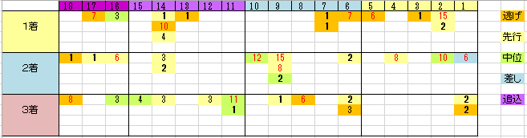

---
title: "2015/04/19　皐月賞　not展望"
date: 2015-04-17 20:33:25
category: "ギャンブル"
---

◆結果

外しました

どうもいけません。

まあそのうち当たることもあるでしょうけれど、桜花賞・皐月賞とも、ここまで枠順データが裏切られるとは…

開催地変わりに来たいです。

◆買い目

こうして見ると、１，２番人気なら枠順は関係なさそうです。

ただし、３～５人気(５人気はそもそも来ていませんが)の場合、外枠ならば、と言えそうです。

&nbsp;

◆皐月賞のポイント

今年、調べていて気になったことを書き留めておきます。

&nbsp;

皐月賞で１番人気は強いが、意外と「名馬」は１番人気じゃない点について

&nbsp;

2014イスラボニータ(4-1-0-0-0)…２人気１着

　共同通信杯１着、東スポ２歳１着

2013エピファネイア(3-0-0-1-0)…２人気２着

　弥生賞４着、ラジオニッケイ２歳１着

2012ゴールドシップ(3-2-0-0-0)…４人気１着

　共同通信杯１着、ラジオニッケイ２歳２着

2010エイシンフラッシュ(3-0-1-0-1)…１１人気３着

　京成杯１着、５００万下１着

2008キャプテントゥーレ(2-0-2-1-1)…７人気１着

　弥生賞４着、朝日杯FS３着

2006メイショウサムソン(4-3-1-1-0)…６人気１着

　スプリングS１着、きさらぎ賞２着

2005ディープインパクト(3-0-0-0-0)…１人気１着

　弥生賞１着、若駒S１着

2004ダイワメジャー(1-1-1-1-0)…１０人気１着

　スプリングS３着、５００万下４着

&nbsp;

…まあ、どこまでを名馬と呼ぶかについてはちょっと問題もあるピックアップだとは承知していますが、とりあえず、メイショウサムソンとかエイシンフラッシュとか「あれ?こんな人気だったの?」とか感じる方もいらっしゃるのではないでしょうか。

つまりは、皐月賞で活躍してのちに名馬になった馬はいるが、決して前評判は高くないこともしばしばだったということです。

