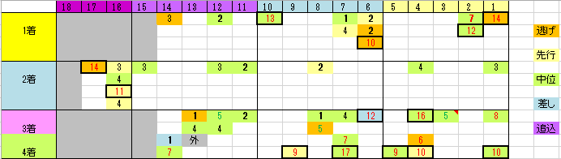

---
title: "2015/05/03 天皇賞(春）　展望"
date: 2015-04-27 00:00:53
category: "ギャンブル"
---

■結果

外しました orz

グヌヌ…①

&nbsp;

■買い目

昨年(２０１４年)の春天は、この１０年一度も４着以内に来ていなかった「差し馬」が馬券に絡むという波乱が生じました。

騎手の戦術が変わってきた兆しなのか、たまたまの一過性のものなのかはわかりませんが、私としては、無駄に買い目が広がるので、再度出現するまでは、これまで通り差し馬は全切りで行くつもりです。

&nbsp;

◆人気別

これほど１番人気の信頼性が低いレースも珍しいと思います。

過去１１年（１～４着）の上記データを人気別に頭数カウントしてみます。

・１人気：４頭

・２人気：６頭

・３～５人気：１５頭

・６～７人気：５頭

・９人気以下：１３頭

・その他１頭

明らかに、波乱が起きやすい傾向が分かると思います。

このところ、大波乱が少なったＧ１戦線に、久しぶりに穴党への福音があるかも？

&nbsp;

◆ローテ傾向

「日経賞」「産経大阪杯」「阪神大賞典」、それに「京都記念」とオープンの「大阪ーハンブルクC」がほとんどです。

&nbsp;

◆距離実績

２，３００m以上で勝利経験がある馬がほとんどで、１，２番枠ならロスなく運べるからか、馬券内実績程度でも事例があります。

&nbsp;

◆格は不要？

あるには越したことないのでしょうけれど、Ｇ１連対またはG2勝ち経験が無くても馬券に絡んできます。

Ｇ１連対またはG2勝ち経験

あり：２７頭

なし：１７頭

特に、穴馬は格下馬から出やすいので、運よく珠玉の１頭を見つけたいものです。

&nbsp;

&nbsp;

