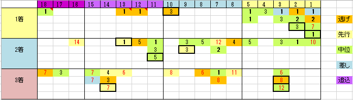

---
title: "2015/05/31 ダービー　展望"
date: 2015-05-24 17:40:50
category: "ギャンブル"
---

◆結果

外しました

でも今回は負けて悔いなし

&nbsp;

去年４月末に岩田騎手買いの自粛を決めて１年経過しました。

来週からは通常に戻ります。

&nbsp;

◆買い目

※太枠で囲んであるのは、過去３年分。

&nbsp;

２０１２年１着のディープブリランテが３番人気で外目の枠から勝った以外は、おおむね傾向どおりのパターンになっており、ダービーは枠順の影響が大きいことがわかります。

・１着馬は内枠有利

・３着に中穴が紛れ込みやすい

&nbsp;

◆ローテーション

皐月賞ほかの近々のローテについては他のサイトでも載っていると思うので省略します。

いわゆるステップレース以外では、一昔前は「きさらぎ賞」と「ラジオ日経」だけマークしていればよかったのですが、最近では、「東スポ杯２歳」「共同通信杯」ローテ組が馬券に絡んでいるので、要注意。

きさらぎ賞の価値は減っていませんが、「東スポ」即切りは危険です。３連複で抜け目が出る危険大です。

&nbsp;

◆連穴について

４番人気以下の連穴については、１着馬はただ１頭、エイシンフラッシュのみ。他は連穴です。

&nbsp;

まずはエイシンフラッシュについてですが、１枠１番という連穴枠順に加え、ジンクス的な「皐月賞３着馬」にも当てはまります。

やはり、１枠は要注意。

ほかにも（人気馬ですが）アドマイヤベガ、ワンアンドオンリー、ロジユニヴァースといった皐月賞馬券外の馬の連対を生む要素になっている感じです。

&nbsp;

◆連穴パターン

・有名どころの青葉賞１着馬

※競馬には関係ありませんが、「若葉」は新芽で薄緑色、時期としては５月上旬までのことを指し、「青葉」は色が濃くなってきた時期で新芽よりは濃いさわやかな緑、時期としては５月中下旬以降を指すようです。俳句の季語や手紙の書き出しにも使われます。ただし旧暦も絡むので、競馬でいうところの「若葉賞」「青葉賞」がぴったりの時期に行われているとは限りません。

・他はすべて、皐月賞馬券外

わかりやすい組み合わせですね。

なお、<u>過去１６年の連対馬は全て重賞馬</u>です。

&nbsp;

◆ヒモ穴（３着馬）

まずは３着馬の人気を確認してみます。（過去１６年）

１人気：１頭

３人気：２頭

４人気：１頭

６～８人気：１０頭

９人気以下：２頭

&nbsp;

この中穴の出やすさ、ある意味恐ろしい結果です。

お金のある場合は、連軸さえ決めてしまえば、◎⇔○→総流し、というのもアリですね。◎○が人気筋なら、馬連より妙味があるんじゃないでしょか。

&nbsp;

・ヒモ穴研究

３着ヒモの場合、重賞馬以外も紛れ込んできます。

勝利に限って言えば、オープン馬はおろか５００万下・未勝利しか勝った経験がない場合もあります。しかしほとんどの馬は、<u>「重賞連対」経験はある</u>、という点には注意が必要です。例外はただ１頭、２００１年ダンシングカラー。

