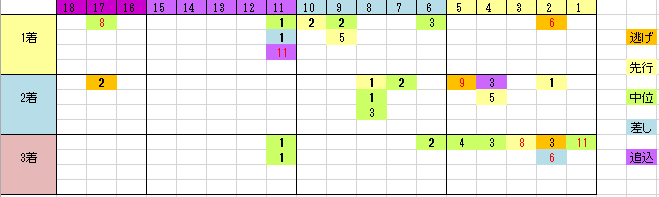

---
title: "2015/06/28 宝塚記念　展望"
date: 2015-06-14 16:57:24
category: "ギャンブル"
---

◆結果

外しましたorz…

&nbsp;

◆買い目

●実績不足の穴は、内枠に

一目見て、外枠不利がよく分かります。昔はそうでもなかったんですが、この９年は顕著ですね。１２番枠より外は切ってもいいんじゃないかというくらいです。

対して内枠から穴馬がよく出ています。

&nbsp;

●連対馬に必要な実績

中距離（1,800ｍ～2,200ｍ）でG2以上の「勝利経験」

過去9年で例外はありません。

※なお、3着馬の場合ちょっと落ちて、例外あり。実例では「秋天3着」「皐月賞3着」「秋華賞2着」「京都記念2着」があります。

&nbsp;

●人気馬について

過去9年のデータを分類してみると、危険な人気馬のパターンがありました。

（１）牝馬

決して悪くはないんですがね。人気しても勝ちきるまではいかない、という印象です。今年はそんな女傑はいないんで大丈夫だとは思いますが、人気になっても買いづらいです。

勝ったのは、穴馬だったスイープトウショウのみで、持ち上げられたジェンティルドンナもブエナビスタも2，3着まで。昨年は3着に中穴のヴィルシーナが入りました。

なお、全てＧ１馬です。

&nbsp;

（２）休明

中11週以上の馬は3着まで。軸にはできません。

逆に、中7週（春天、海外戦からの参戦）ローテはOK。

&nbsp;

●その他

・高齢馬

7歳以上は全滅。

&nbsp;

（続く）

&nbsp;

