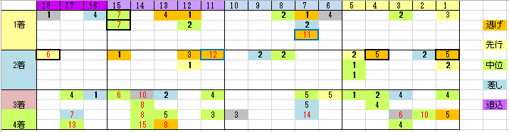

---
title: "2015/11/15 エリザベス女王杯　展望"
date: 2015-11-08 19:14:00
category: "ギャンブル"
---

◆結果

外しました

来週、再来週と土日祝日に工事監理があるため（そして代休無し・３６協定違反だろ）、競馬はお休みです。

&nbsp;

◆買い目

&nbsp;

先週は、８枠不利と判断して、７，８枠と外々にやられました。

この２年くらい、過去に有利とされた枠の真逆に集団が飛んでくることがちょくちょくある気がします。

サンデーサイレンス第１世代とは戦法が変わりつつあるのでしょうか。

&nbsp;

さて、エリザベス女王杯は、まんべんなく枠がばらけているので、枠の心配は無用。

&nbsp;

逃げ馬から連穴が出ています。

ただし、２桁馬番の中位差しには注意。穴が出ています。

&nbsp;

◆３歳牝馬について

（桜花賞）、オークス、（ローズＳ）、秋華賞という黄金ローテを馬券内でクリアしてきた馬はさすがに強く、２ｋｇの斤量減も効いて馬券内に来ています。

&nbsp;

◆４、５歳馬のリピーター

３歳で馬券内に来た馬が４歳時に出走するとだいたい半分くらいが４歳の時も馬券内に。押さえが必要なパターンです。

また、４歳で馬券内に来た場合も５歳で連対に来る事例があります。

全体としてリピーターレース傾向が強いです。

&nbsp;

◆格下馬

今年の登録馬にはいませんが、1000万下を勝ったばかりで好調なので来ちゃったパターンもあります。

&nbsp;

データとしては、ヌーヴォレコルトが堅い軸◎として、相手は混戦。

３歳馬も黄金ローテ（着順を伴うもの）には程遠いですし、ラキシスも３・４歳と続けて馬券内に来て今年も？

どうでしょうかねぇ（ラキシスは女王様なので相応しいといえばそうなのですが）

