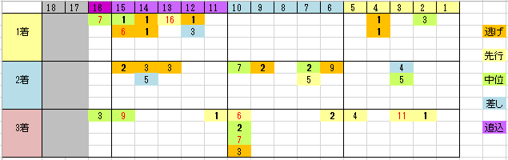

---
title: "2016/02/21 フェブラリーＳ　展望"
date: 2016-02-14 22:21:50
category: "ギャンブル"
---

◆結果

残念、外しました

◆買い目

&nbsp;

◆注目ポイントは、枠順と馬体重にあり

・枠順について

上図のとおり。

特に1着は外枠有利が見て取れます。

&nbsp;

・馬体重について

過去10年の馬券内の場体重別分布は以下のとおり

馬体重　1着-2着-3着

５００ｋｇ未満：２-４-３

５１０ｋｇ未満：１-４-０

５１０ｋｇ超過：７-２-７

当日馬体重で５１０ｋｇを超える巨漢馬が馬県内率５０％を超えている点に留意が必要です。

&nbsp;

