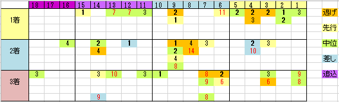

---
title: "2016/11/06 アルゼンチン共和国杯　展望"
date: 2016-11-01 16:59:45
category: "ギャンブル"
---

■結果

外しました

休み明け、初コース、58kgをはねのけて。大魔神フィーバー再来か？

&nbsp;

■予想＆買い目

&nbsp;

このところ、軸馬選びには失敗していないのですが、穴が・・・。

かと言って人気馬の複勝とかじゃ、馬券買う意味ないので、なんとか今週はオラクルが降りてくるといいのですが。

&nbsp;

さて、アルゼンチン共和国杯です。枠順にも脚質にも偏りはないような感じに見えますが、実際には、年ごとに「外差し」「内枠」に偏った年があります。

ただ、それは事前に知りようがないので、別の切り口で狙っていくしかありません。

※今年はもしかすると外差しかも。先週の馬場はラチ沿いがひどかったのがテレビでもわかるくらいでしたから。

&nbsp;

◆印・調教・近況に注目

過去4年または5年のデータです。

&nbsp;

・印が集中した馬　（３頭／４年）

印が集中した人気馬は、高確率で来ています。

年ごとに原則１頭しかいないので、割合としては高いことになります。

&nbsp;

・調教特注の馬　（３頭／４年）

日刊には調教特注というコーナーがあるのですが、これに掲載された馬も高確率です。

これも年ごとに１頭しかピックアップされないことと、１番人気は推奨しない場合が多いので、妙味です。押さえる価値ありです。

&nbsp;

・近況がいい馬　（７頭／５年）

上記を除く出走馬のうち、偏差値データで近況データがいい馬が結構な数、馬券に絡んでいました。

ただし、年ごとに数頭出走しているデータです。

今年の出走馬が確定した時点でこのブログに掲載するので、よろしければ参考にしてヒモに加えることを検討してみてください（木曜夕方）。

&nbsp;

△東京実績（１／４頭）

上記を除く出走馬のうち、東京実績の偏差値が高い馬は、３着が１回と意外と振るいません。

&nbsp;

×距離実績（０／１２頭）

上記を除く距離実績がいい馬(２５００ｍ以上実績)は、まったく来ていません。

※いい馬はほとんど上記までで、抽出された残りなので、この中には「近況不振な馬」や「高齢馬」が、かなり含まれます。

これらの馬の一発逆転は厳しく、狙いづらいです。

&nbsp;

×牝馬

出走頭数も少ないのですが、過去１０年馬券になっていません。

&nbsp;

●東京2400m(1600万下以上連対経験）

ほかのサイトでもたぶんこの点は強調されていると思われます。

相性で来るならこのパターン。ただ、このパターンに当てはまる馬は多いうえ、穴人気することもあり、妙味は疑問です。

&nbsp;

<del>●近況がいい馬(登録段階)</del>

<del>&nbsp;</del>

<del>シュヴァルグラン、ヴォルシェーブ、アルバート、ハギノハイブリッド、トルークマクト、プレストウィック</del>

<del>&nbsp;</del>

<del>この中では、印が集中する馬に該当する見込みが高そうなシュヴァルグランを除くと、ヴォルシェーブがいい感じです。</del>

●近況がいい馬(出走段階）

アルバート、シュヴァルグラン、ヴォルシェーブ、プレストウィック

&nbsp;

