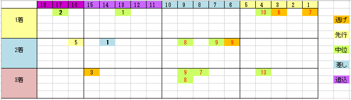

---
title: "2017/09/03 新潟記念　展望"
date: 2017-08-31 20:38:21
category: "ギャンブル"
---

■結果

外しました

&nbsp;

■買い目

&nbsp;

・外枠に穴無し

馬柱を作っているときは気づかなかったのですが、こうして表に移してみると意外な程偏りが見えます。

６番人気以下の穴馬は全て一けた馬番でした。

&nbsp;

・脚質は逃げか中位

脚質にも偏りが見えます。

特に、差し馬が極端に少ないことが目立ちます。

結構人気になることが多いのですが、信頼度は良くないと考えたいです。

&nbsp;

◆その他

６歳、７歳が妙味。穴馬も結構出ています。

&nbsp;

