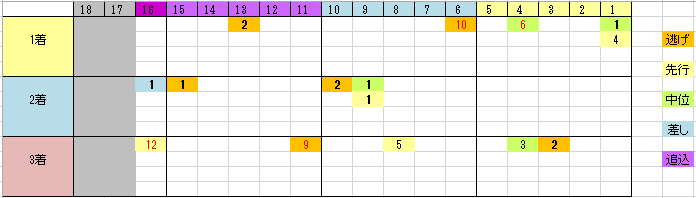

---
title: "2017/09/10 セントウルＳ 展望"
date: 2017-09-03 16:21:16
category: "ギャンブル"
---

■結果

外しましたorz・・・

&nbsp;

■買い目

&nbsp;

差し馬が少ないように見えますが、阪神1200mなのでこんなものかも。

枠順も、どちらかというと内有利に働いているみたいですが、余り強い偏りとまでは言えず、最内から大外まで馬券内に来ている馬がいます。

&nbsp;

◆その他の傾向

・１番人気が５年連続馬券内

これは「ありそうでない」傾向で、強く・調子のいい馬の信頼度が高いです。

&nbsp;

・西高東低

関東馬は、過去５年でたった１頭（１２番人気アンシェルブルー）

&nbsp;

・大穴のポイントは「逃・先」「牝馬」から

９番人気以下としては

11人気・ラヴァーズポイント(2016年　6牝　逃）

10人気・アクティブミノル(2015年　3牡　逃）

12人気・アンシェルブルー(2012年　5牝　先）

5年で3頭という事なので、臭いのがいたらヒモには加えておいた方がよさそうです。

&nbsp;

