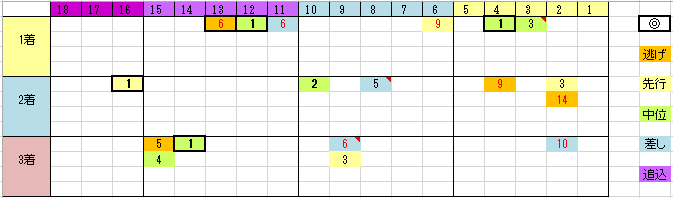

---
title: "2017/09/18 セントライト記念　展望"
date: 2017-09-17 23:39:59
category: "ギャンブル"
---

■結果

外しました

&nbsp;

■予想と買い目

このところ仕事のスケジュールが立て込んでいてオーバーフロー気味です。

せっかく遅まきながらの夏休みを週に１回取らせてもらっているのですが、結局内に仕事を持ち帰って処理しているだけという、なんともしょぼい状況でした。

とうとう週末に体調を崩して２日間寝込んでいました。

&nbsp;

それでも日曜午後にはある程度体調も回復してきたので、セントライト記念のデータを作ってみました。

データは２０１６～２０１１年＋２００８年(稍重)

&nbsp;

・枠順と脚質について

枠・脚質共に、まんべんなく出ています。

少々内枠有利かなという感じもしています。

それは、「中山・福島」連対経験なし、または、「1900～2400m」連対経験なし、といった馬でも内枠からなら馬券になっていたからです。

&nbsp;

・実績最上位馬は５／６

G1連対馬の出走が無かった2013年を除く５年で、実績最上位馬が必ず馬券に絡んでいました。

今年の場合は、⑦アルアインが相当。

&nbsp;

・穴タイプは「逃げ」か「差し」

上図のとおり大穴はこの２タイプから出ています。

&nbsp;

