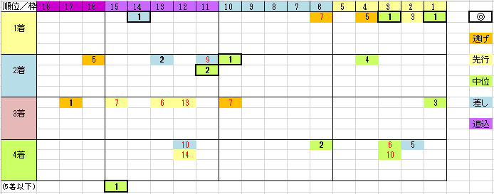

---
title: "2017/10/22 菊花賞　展望"
date: 2017-10-16 00:34:07
category: "ギャンブル"
---

■結果

はずしました…orz

■買い目

データは2010年以降(不良馬場の2013年を除く）６回分です。

&nbsp;

・偏差値データでトップだった馬

偏差値トップ（表中太枠で囲まれた馬）は、６回中５回連対と、かなり信頼性が高いです。

(例外は2014年のワンアンドオンリー)

&nbsp;

・１着は内枠

2011年のオルフェーブルを除き、1着馬は３枠より内側から出ています(白黒赤帽)。

&nbsp;

・２着馬は外目

２着馬は、６回中５回が２桁馬番で、しかも中位・差し組が目立ちます。

&nbsp;

・３着は外穴先行狙い

３着馬は、６回中５回が２桁馬番で、かつ逃げ・先行が目立ちます。

&nbsp;

・内枠の中位について

２着に１頭（2014年サウンドオブアース）、３着に１頭（2011年トーセンラー）います。

共にそこそこの人気馬ですが、上図から4着が多いのが気になります。

来そうでなかなか来づらいのかもしれません。１番人気でなければ、人気でも押さえまででしょうか。

&nbsp;

◆前走について

ほとんど意味がないかも。

というのが、データ上トップだった馬以外では、トライアル２走の掲示板以内、札幌記念、１０００万下連対のいずれかが該当ですが、

それって、菊花賞にまで出てこられる馬なら、ほぼすべて該当する条件です。

&nbsp;

◆穴脚質は逃げ・先行

どちらかというとポイントはこれかも。

上図のとおり、毎年穴をあけているのはこの傾向の馬です。

データ派ならみんな気付いているこの傾向なのに、なぜか毎年のようにちゃんと穴になってくれています。

&nbsp;

◆関東馬は１頭だけ（１／１８）

ゴールドアクターが３着に来ただけです。（2014年）

&nbsp;

■登録段階では

登録馬段階ではトップデータは、アルアインでした。

&nbsp;

