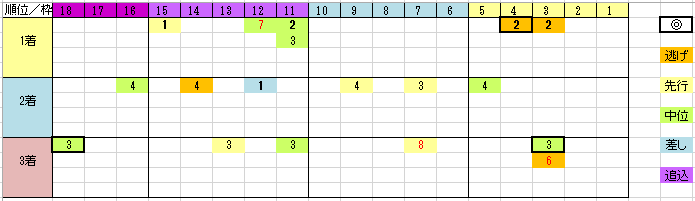

---
title: "2017/11/05 アルゼンチン共和国杯（G2)　展望"
date: 2017-10-29 19:06:41
category: "ギャンブル"
---

■結果

外しました

&nbsp;

■買い目

※データは2011年以降の６回

&nbsp;

最近のこのレースは、「荒れそうで荒れないハンデ戦」という感じです。

荒れても中穴までしか馬券内に来ていません。

&nbsp;

枠順脚質とも、有利不利はなさそうです。

&nbsp;

・ハンデの傾向

５５ｋｇ以上がほとんどで、５２ｋｇが２頭

ハンデ戦によくある５４、５３ｋｇのパターンが出ていません。

&nbsp;

・馬齢と牝馬

６歳までなら来ていますが、７歳以上は無し。

牝馬はデータが少ないので何とも言えませんが、これまた１頭も無し。

&nbsp;

◆東京2400m芝実績

府中の芝2400m戦での実績がある馬が来ています。

これはダービーとかではなく条件戦(1600万下、1000万下)でOK

&nbsp;

登録馬で条件に合いそうなのは、スワーヴリチャード、ソールインパクト、マイネルサージュ、アルバート

