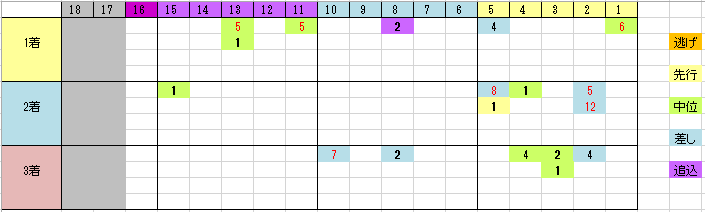

---
title: "2018/8/19 札幌記念（G2)展望"
date: 2018-08-12 16:41:18
category: "ギャンブル"
---

◆結果

本命サイドでした

とりがみ～

まあ、来ていても３連複を買い間違いしてるので、どうにもなりませんが。

&nbsp;

◆買い目

※データは過去６年

&nbsp;

お盆モードになって通常の発注が止まったので、時間的に余裕ができました。

久しぶりに良そうに時間が割けます。嬉しい。

&nbsp;

そういえば、為替関係では、TRY（トルコ・リラ）がデフォルトの危機かもという話が出ています。信頼しているブログでは、EUの銀行がトルコ国債を見放したたための金曜の暴落らしいです。チャートを見るとすごかったです。

つられてなのか、円高モードに。

&nbsp;

さて、札幌記念。

最近の傾向は、脚質的には完全に「差し」天国。

加えて、有力どころのパターンとしては４つ。

（１）単勝３倍を切った馬

（２）内枠の高齢差し馬

（３）前走函館記念（サマー2000組）の中位

（４）休み明け前走G1出走

このワイドボックス買っていれば、抜けが来ても、惨敗だけは避けられるんじゃないかってくらいです。

今年もこの傾向が続くとみて、買い目を絞っていこうと思っています。

枠順確定が楽しみです。

