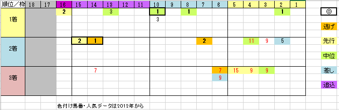

---
title: "2018/09/30 スプリンターズＳ　展望"
date: 2018-09-23 17:20:00
category: "ギャンブル"
---

◆結果

ちょっと浮き

①ラインスピリットと武様に感謝( -人-)

&nbsp;

◆予想＆買い目

ま～た買い間違いしてました。疲れてるな～

買い間違いをフォローする③軸から⑤⑥⑫の３点の買い足しです。

※データは2012年から。

傾向が切り替わった2012年から彩色しています。

&nbsp;

◆27日追補

どうやら台風が列島直撃の模様。

スプリンターズステークスは近年晴れの特異日でしたので、データの信頼性が揺らぎます。

重馬場でもヘタレないタフな実力馬を押さえる必要を感じています。

&nbsp;

まず、データを馬柱に移してみて感じたのは、G1の割にデータ上位の馬が、数値順に来ないレースだなぁ、ということ。

◎が来ていないわけはないんですが、○（次点）とかほぼ来てませんでした。

なんで？

しかし、枠順・脚質・人気分布表に落としてみると、見えてきたものがあります。

&nbsp;

上図のとおり、かなり偏りがあることが分かりました。

（よって予想は、この傾向が今年も続く、という前提でやってみようと思っていますが。）

&nbsp;

さて、上図ではパターンがほぼ２つ（３つ）に絞り込まれていることが見て取れます。

①１～３人気（１つじゃなくて３頭じゃん！と怒らないで）

②内目（６番枠以内）の穴馬

③偏差値データ◎（これはデータ①に包含されます）

&nbsp;

このパターンに従えば、下手すればチマチマ予想するのなんかやめて、当日１～３人気と内目の穴馬のボックスを買えば、とりあえずは（＝トリガミになるかもしれませんが）当たる！という狸計算ができるわけです。

&nbsp;

金曜に枠順が決まるまでは静観、静観。

