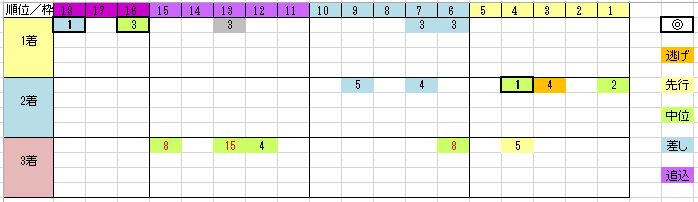

---
title: "2018/10/14 秋華賞　展望"
date: 2018-09-30 17:59:54
category: "ギャンブル"
---

◆結果

当たりました。

ただし、①ラテュロスの粘りを注視していて、アーモンドアイのゴール通過（＝３冠馬の誕生シーン）を見逃しました。

意外だったのは配当。この組み合わせで３連複２０倍以上ついたの？

&nbsp;

◆予想＆買い目

前目で競馬したそうな馬が10頭、向こう正面でもそれなりに消耗してコーナーもごちゃつきそう。

データは過去５年。

時間が無いのもありますが、傾向が変わってきているので５年分だけにしました。

&nbsp;

しばらく前までは、京都重賞は１枠を買えってくらいに白帽が良く飛び込んできていたのですが、このところその傾向は影を潜めているようです。

改修された？

データ本命◎が勝った年が２回ありますが、それ以外では３番人気が３回勝っています。

ちなみに、この３番人気の３回はすべて紫苑組。

ローズS組が多いのは確かですが、それだけにに縛られていると痛い目に合う、という感じです。

&nbsp;

差しタイプが有利

脚質的には差し傾向が強く、中位・差しを軸にすべきです。

２０１６年には、逃げ型に分類されるパールコードが２着に来ましたが、それ以外はほぼ中位・差し型。

それと、この時期の３歳牝馬ではよくいる追込み型（デニムアンドルビーやジュエラー等）は４着によく来ています。(４連単があれば狙いたいくらい)

&nbsp;

関西馬が圧倒。

関東馬が苦戦しています。圧倒的人気だったヌーヴォレコルトも２着まででした。

&nbsp;

【追補 2018.10.7】

今年は、久々の２冠馬アーモンドアイがいるので、３冠を期待して１着固定で行くと決めました。

実際に、桜花賞・オークスの２冠（JFはカウントしない）を獲った馬は、秋華賞でも（ほぼ）勝っています。

アパパネ、スティルインラブ、（ブエナビスタ）

※ブエナは降着３着

&nbsp;

上記３頭のときには、２、３着にも共通点があって、

①２人気

②オークス４着馬でローズ組

着順は入れ子がありますが、３レースともこのパターン。

ただし今年はパターン②に該当する馬が不在。

まるきり信じるわけではありませんが、このパターンに近い馬券＋当時の４着馬パターンも買います。（たぶん同じこと考えている人多数でめっちゃ売れるでしょうけど）

&nbsp;

