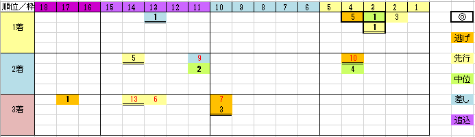

---
title: "2018/10/21 菊花賞　展望"
date: 2018-10-14 18:23:40
category: "ギャンブル"
---

◆結果

外しました

獅子王司の死亡フラグは当たったのに…orz

&nbsp;

◆予想＆買い目

（日曜午前追加購入予定：本命サイドの3連複）

という買い目を考えてきましたが、どうにもダメで、データの呪縛にやられています。

人気馬で買いたくなる馬を探してみると…これがなかなかいない。

データ上傷が無い馬が今年はいないんです。（そういうときほど人気スジで決まったりするんでしょうけど）

わずか、関東馬ながら栗東で追い切った④ジェネラレウーノに期待してみることにしました。

(データは過去５年)

&nbsp;

この５年のうち、２回が不良馬場での開催となっています（上図中の二重下下線部）。

１番人気は４／５（内、勝利３回）

&nbsp;

逃げ先が穴になりやすい傾向が見て取れます。

特に２桁馬番の逃げ先が５回中３回も３着ヒモできています。

後述する理由から私は、３連複よりもこのワイドの組み合わせと複勝を狙ってみようかと思っています。

毎年来るわけではありませんが。

&nbsp;

◆基本的データ

・関西馬

関西馬が圧倒しています。

この５年で来た関東馬は、ゴールドアクター（2014年３着）ただ１頭

&nbsp;

・神戸新聞杯組

神戸新聞杯で馬券内に来た馬が９頭とその他を圧倒。

夏明けての成長を証明した馬を信頼。

&nbsp;

しかし・・・

それ以外のも結構来ていているんです。

３連複で押さえようとするとかなりの点数になってしまいます。

それでも抜けが出てしまうかもしれませんし。

ちなみに、ここまでのデータに沿って、３連複を買ったとして、５回中２回しか来ません。

&nbsp;

そこで最初の方で書いた通り、逃げ先穴と軸のワイドをメインにして、買い目を絞り込んでもいいかな、と思ったわけです。

とりあえずは、枠順確定まで待機します。

&nbsp;

（追補）

実はこの5年、馬券内に「G1」が来ていない不思議

&nbsp;

