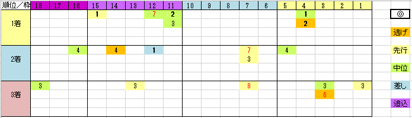

---
title: "2018/11/04 アルゼンチン共和国杯　展望"
date: 2018-10-28 22:49:08
category: "ギャンブル"
---

◆結果

外しました…orz

穴を獲れず

&nbsp;

◆予想と買い目

データは詳細をロストした2014年を除く2011年～2017年の6年。

&nbsp;

・意外と荒れないアルゼンチン共和国杯？

目黒記念でとんでもない穴馬が来ることもあるので、荒れるイメージのある東京芝2500m。

しかし、アルゼンチン共和国杯では、2014年を含む2011年以降において、単勝20倍以上の馬が馬券に絡んだことは一度もありません。

&nbsp;

・脚質は前目有利

差しタイプが来たのは１回だけ。（2011年1番人気オウケンブルースリ2着）

あとは、後ろからでもせめて中位タイプまで。

&nbsp;

・過去の実績より勢い重視

偏差値データ上、東京・2500m以上の連対率がトップの◎が来たことは一度もなく、どちらかというと、近況データが良い馬が馬券に絡んでいます。

&nbsp;

・7歳以上は切り

6歳まで。

リピータ含めて、7歳以上は来ていません。

&nbsp;

・東京2400m条件戦勝ち馬に注意

全部ではありませんが、中穴をあけている馬によくあるのがこのタイプ。

&nbsp;

データ的に生き残ったのは

エンジニア、ムイトオブリガード、ルックトゥワイス

それと(2500m以上では頭はないものと決め打ちしてる)ディープインパクト産駒からは、ジナンボー、ヘルファリテ

差し馬分類ですが、ホウオウドリーム

この中から人気になった馬を狙うつもりです。

