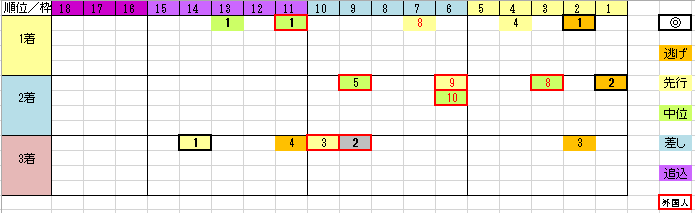

---
title: "2018/12/23 有馬記念　展望"
date: 2018-11-25 18:14:13
category: "ギャンブル"
---

◆結果

外しました

穴もミルコも来ませんでした

しかし、１点勝負できたので悔い無し！

&nbsp;

◆買い目＆予想

データは2013年を除く、2012年以降5年分

&nbsp;

・穴は外国人騎手ばかり

もうそろそろジンクスでもなくなりそうですが、外国人騎手が穴をあける傾向がしぶとく残っています。

&nbsp;

・12番枠より外は不利

昔から外枠は不利だったのですが、近年外枠差し穴は出ていません。

&nbsp;

・６歳以上は割引き

近年はこれが大きな傾向

これも上記同様、死んだふりして直線だけ差す、という戦法では通用しなくなったからでしょうか。

&nbsp;

・ローテ

前走JCがベスト

穴ローテは、京都大賞典→JC→有馬

&nbsp;

・体験レース

馬券内の馬に多い共通点

菊花賞、皐月賞、春天、秋天、有馬(リピーター)

いずれかで馬券内

&nbsp;

【追補】2018.12.17

穴　クリンチャー

内目の枠に入ることができれば…

&nbsp;

