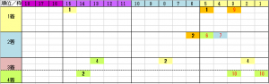

---
title: "2020/04/05 大阪杯　展望"
date: 2020-03-29 16:36:17
category: "ギャンブル"
---

　

◆結果

外しました orz

　

◆予想＆買い目

※データは過去3年

　

[E:#x2606]圧倒的な内枠有利

　１～６番枠まで

　

？前走人気

　前走Ｇ２以上で、３番人気以内（４着馬まですべて該当）

　

○４歳馬ならクラシック連対

　皐月賞かダービーで連対　

　

○古馬なら2000m～2400ｍで

　Ｇ１連対、またはＧ２勝利

　

◎　ワグネリアン

○　ダノンキングリー

穴　ステイフーリッシュ

　 

◆15年ぶりに新しい漫画シリーズを購入しました

　

いまだに週刊少年ジャンプを読んでいるのがバレるので恥ずかしいですが、4月3日にジャンプのコミックスを買いました。

ＦＳＳなどずっと続いている漫画の続刊などを除くと、実にハンター×ハンター（グリードアイランド編）以来の新たな漫画シリーズです。

買ったのは「アンデッド　アンラック」第１巻。

　

鬼滅の刃も、登場時面白いなと思っていたのですが、コミックスを買うには至らず。

（そうそう、鬼滅の刃の話に逸れてしまいますが、４月６日発売号で、炭治郎が無惨に鬼の王の後継にされてしまいました。

私は、対　猗窩座（あかざ）戦のときの「鬼の体の復活」の伏線が、対　無惨戦で拾われ、無惨復活かと思っていたのですが、違う展開に。

あのときあかざは、自ら復活を拒みましたが、炭治郎で伏線が拾われるのでしょうか。禰豆子ちゃん登場で、仲間の声援も受けて、人間に戻って復活、とか）

　

週刊少年ジャンプは毎週買っているので、コミックスを買っているのは、どうしても取っておきたい可能性がある漫画のみデス。

この「アンデッド　アンラック」というマンガは、

「不◎」～◎に文字が入る～という能力を持つ『否定者』と定義されるキャラが登場して、その能力を駆使して戦いを繰り広げるという設定です。

そして「不死（２００歳の死にたがりの青年：？）」が、自分に死を与えてくれるかもしれない「不運（触った他人に不運を与える少女：巨乳）」を守るために、課題（敵）をクリアしていくという流れです。

メカデザインがちょっとダサイ、という事には目を瞑れば、掛け合い漫才的なテンポ良いセリフのやり取りが面白い漫画です。

　

このマンガに「不変」という敵が登場しました。

この女性とのストーリーが実に良かった！

話の展開はあえて書きませんが、最も私の琴線に触れたのは、この敵の女性の名前が「ジーナ」さんであるということ。

絶対、豚さんが登場するあの作品へのオマージュ・リスペクトと思っています。

このため、コミックス第１巻を買ったのです。

　

なのに、なんと、ジーナさんとの、あの別れのシーンは次巻（第２巻、６月発売）ですと！？

