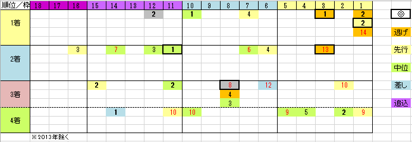

---
title: "2020/05/03 天皇賞（春）　展望"
date: 2020-04-19 17:39:55
category: "ギャンブル"
---

◆結果

外しました　orz

 

◆予想と買い目

　

ちょっと早いですが、春天2020の展望を調べていきます。

データは７年分（2013年を除く）

枠順の影響を大きく受ける、というレース傾向があります。

予想は枠順次第

　

・１７番枠、18番枠は不利

　2005年ビッグゴールドの2着以来、馬券内に来ていません

　多頭数の場合には注意が必要。

　

・１～３番枠の逃げ先は大穴

　この10年くらいは顕著な傾向

　もはや、大穴になりづらいかもしれません。

　

・人気馬（１～4番人気）は特定レース実績

　菊花賞連対、もしくは春天馬券内

　特に「菊花賞馬」には特注

　例外　トーセンジョーダン(2012年)、シュヴァルグラン(2016年）

　

