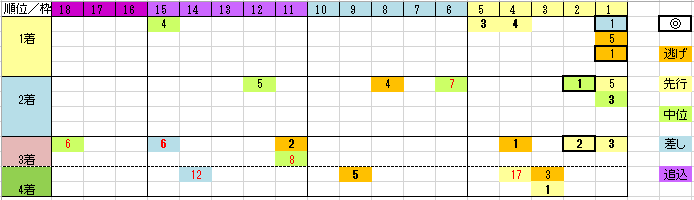

---
title: "2020/11/29 ＪＣ展望"
date: 2020-11-07 23:26:59
category: "ギャンブル"
---

◆買い目

設計＆入札業務が連発していて土日出ずっぱりの11月。

とりあえず夜中にデータだけ集計して、ジャパンカップだけは買いたいと思っています。

　

・連軸は、近況の良い実績馬。

ただし、3着もある想定で

　

・連穴は、G2、G1レースで掲示板

掲示板率の高い好走馬が、タフな東京最終週で馬券になっています。

　

・単穴は、内枠から

過去6年で、6番枠より外で勝ったのは、2015年ショウナンパンドラ１頭

　

・追込み脚質では届かない

近４走で、４角の位置が「１５番目以下」だったことがあって、馬券になったのは

2018年アーモンドアイただ１頭

　

[E:#x2605]全体的に見て

内枠有利になっているが、穴は外枠から。

 

