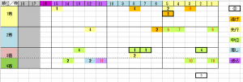

---
title: "2020/04/03 大阪杯　展望"
date: 2022-04-02 22:10:10
category: "ギャンブル"
---

◆結果

外しましたorz

　

◆予想と買い目

※データは2017年以降

　

過去5年の傾向は、以下のとおり

・１～４人気が強い

・しかし、3番人気は一度も来ていない

・1着は逃げ先行から

・中位差しの人気馬は3着まで

・穴は内枠中位のタイプ

　

なお、昨年のレイパパレ以外、4着以外の馬は全て

G1連対、またはG2勝利、いずれかの実績がありました。

　

　

