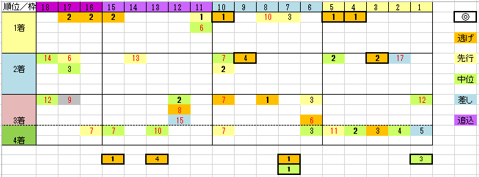

---
title: "2022/05/08 NHKマイル　展望"
date: 2022-05-03 16:09:42
category: "ギャンブル"
---

◆結果

当たりました

（予想は当たってませんけどね）

　

◆予想と買い目

※データは過去10年

　

荒れることで有名なせいか、

逆に、穴オッズが落ち着いてしまう、NHKマイル。

　

◆１，２番人気は無条件で信頼

単勝人気を

<strong>1人気</strong>ー<strong>2人気</strong>ー3人気ー4，5人気―6～8人気―9人気以下

に分割して比較

　

①勝ち馬の頭数

<strong>３</strong>－<strong>３</strong>－１－０－１－２

　

②連対馬の頭数

<strong>４</strong>－<strong>５</strong>－２－１－３－５

　

連対馬で見れば、1，2人気の馬は、10年間で9頭の連対馬を出しています。

荒れるレースという割には、上位人気馬は信じていいという結果に。

ただし、一覧表のとおり偏差値最上位馬の取りこぼしも多く、実績より人気を重視したいところ。

　

さて

やはり、荒れる要素は、10年間で5頭も出ている9人気以下の馬の連対。

こいつを当てられるかどうかが勝負の分かれ目か。

　

◆穴馬のパターン

・外枠が多い

・牝馬

　組まれる番組のせいか負担斤量の違いか、偏差値上は押しなべて牝馬が不利という結果に。そのため、ほとんどの牝馬は低い数値になります。データは気にせず。

・イレギュラーローテ

　中距離戦からの路線変更組。前走大敗していてもOK

・マイル戦ならコンマ2差以内

　着順によらず、勝ち馬との着差が０．２秒以内なら狙い目。

　

　

