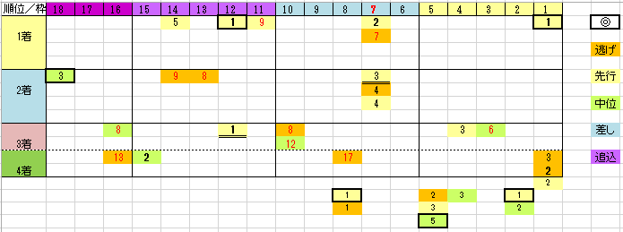

---
title: "2023/04/16 皐月賞　展望"
date: 2023-04-14 17:27:22
category: "ギャンブル"
---

◆予想と買い目

　

◆枠順と脚質

・差し、追込みタイプは無い

・内枠は意外な程不利では?

　2016年以降内枠で連対したのは、コントレイルだけ

・7番枠有利？

・2桁馬番有利

　

◆前走

・弥生賞組は言われるほど不利？

ホープフルS、共同通信杯の連対組が強いのは、データから明らかです。

では、よく比較される、スプリングＳと弥生賞のステップはどうでしょう。

皐月賞馬はスプリングS組からエポカドーロが出ていますが、連対は弥生賞組のマカヒキとタイトルホルダーの2頭が出ています。

　

実は2016年以降、データ上有利な偏差値データ◎と⑦番枠を抜いた馬の前走を調べると、馬券になった馬の前走は、3パターンに絞られます

・重賞勝ち

・共同通信杯 掲示板内

・弥生賞 掲示板内

その他OP勝ちなどは4着まで。

　

◆○○2歳S経験組の不振

例外は東スポ組。

　

　

