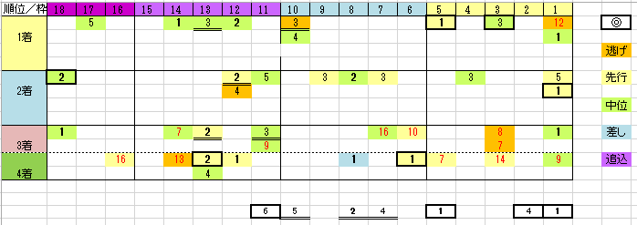

---
title: "2023/05/28 ダービー 展望"
date: 2023-05-25 17:49:23
category: "ギャンブル"
---

◆買い目

　

●枠順と脚質の傾向

　

・差し馬は不利

　図中、水色と紫色は1頭もいません

　前4走で4角11番手以下が２回以上ある馬は切り

　

・逃げ穴は内枠

　逆にも言えて、内枠の穴は逃げだけ

　

・実績馬の取りこぼしは？

　偏差値データ１，２位の馬の取りこぼしが多いです。

　これが、（完全ではありませんが）東京実績の差がありそう。

　別の偏差値グループでテストしてみると、図中のように実績馬が５着以下だった場合の過半数は、東京勝ち経験がありませんでした。

　また、実績馬は比較的2着が多い傾向もあります。

　

　

◆その他の傾向

　上がりの実績はほぼ不要

　上がり３ハロンのデータのうち、第1位を削除して、第2位以下の数値を調べると

　過去6年のなかで4着内に来た馬の上りは以下のとおり

32.9秒以下　０

33.0～33.4秒　１　（エフフォーリア）

33.5～33.9秒　２

34.0～34.4秒　６

34.5～34.9秒　８　（コントレイル）

35.0～35.4秒　４

35.5秒以上　３

　

鬼脚不要では?

　

　

◆穴

偏差値データの実績馬以外で（含む１～４人気馬）、4着までに来た馬のうち、

11番より外側の馬で、馬券内に来たのは、東京実績または距離実績（２０００ｍ～）がトップの偏差値

本当の穴で、（偏差値上は）買い目が無い馬は、全て10番より内側

内枠有利の傾向です。

　

