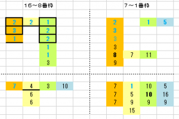

---
title: "2023/10/1 スプリンターズＳ 展望"
date: 2023-09-20 11:46:23
category: "ギャンブル"
---

◆予想と買い目

2023年の偏差値１位は、◎　①ナムラクレア

◎は素直に信頼して軸に。

　

相手候補や穴を探し中

（馬番順で）、②テイエムスパーダ、③ピクシーナト、④ナランフレグ、⑥ママコチャ、⑧メイケイエール、⑨アグリ、⑩マッドクール

　

土曜夜の時点で、本命は⑨アグリに、ヒモはデータ上あり得そうな５頭に。

⑨―①―②③⑤⑩⑭

　

・<strong>内枠有利！</strong>～「7番枠」から内側に、穴馬傾向

破線の十字で切ってあるのは、枠順並びに着順で仕切ったもの。

上段が連対馬で、下段は３・４着。

　

まず目立つのが、8番枠から外側では、１～３番人気しか連対していないこと。

また、穴馬も、好走していなくはないけれど実際には惜しい4着が多く、内枠と比較するとあまり馬券になっていない。

 

　

◆その他のデータ

【脚質】

・差し馬なら、枠順で切る必要なし～１６番枠で3着あり

・逃げ、先行なら、中穴まで

　

【人気馬】

・実績上位で、１，２番人気なら信頼性高い

・上がり馬は、疑問視

　

【前走、ローテ】

2017年以降で、馬券内になった馬

・前走着差は、コンマ3秒以内

・前走コンマ4秒差以上離された馬は、休明でここへ

・前走9着以下は、G1レース

※例外は1頭、2022年ジャンダルム

　

