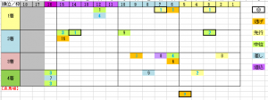

---
title: "2024/02/18 フェブラリーＳ　展望"
date: 2024-02-14 11:18:57
category: "ギャンブル"
---

◆買い目と予想

※2018年以降の良馬場の5回

　

データは良馬場前提のものです。

　

・◎で東京実績が１番

　総合の偏差値データが1位で、かつ開催地（府中）実績が1番だった馬は連軸向き

　２－２－０－０－１

　

・3着は、中枠（６～１０番枠）

　リピーターの穴が妙味。ヒモに。

　過去4着までに入ったことがある馬が、中枠に入った場合

　０－０－３－１－４

　

・芝から転向組は単穴

　近走で芝から転向してきた馬で、１回でも好成績あれば

　

・16番枠は4着まで

　

・牝馬は切り

　

