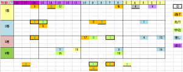

---
title: "2024/03/24 高松宮記念　展望"
date: 2024-03-17 22:52:19
category: "ギャンブル"
---

◆予想と買い目

[E:#x2605]稍重以下の場合に限る、2015年以降６年分

　

・16番枠より外に明暗

１７，１８番枠は、2人気メイケイエールの5着等が最高

対する１６番枠は、6回中3回が馬券内で、5回掲示板内。ただし、全て逃げ馬。

　

・差し馬のヒモ狙い

重馬場実績とは関係なく、８番人気以内は掲示板以内（上記除く）

その他でも１番枠は狙い目。

　

・先行馬は来ていない

クリノガウディが降着４着が最高（呪いか?）

　

<strong>◎前走重賞連対馬</strong>

これは、必ずスポーツ新聞でも書かれることですが、前走でオーシャンSをはじめとする重賞レースの連対馬は、買い。

　

ここまでのデータで、連対馬はフォローしきっています。

例外で、馬券内3着なのは、

キルロード（17人気3着）とインディチャンプ（3人気3着）のみ。

　

