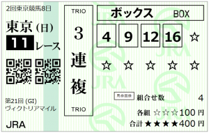

---
title: "2026/05/17 VM展望"
date: 2026-05-16 03:27:18
category: "ギャンブル"
---

◆枠と脚質

◎ ⑫エンブロイダリー

○ ⑯ニシノティアモ

▲ ④エリカエクスプレス

穴 ⑨ココナッツブラウン

　

１人気はエンブロイダリーのようですね。

外枠でも人気の関東馬ニシノティアモが対抗

逃げ残りがありそうな枠に入ったエリカエキスプレスを連下

中位の穴馬では、う～ん、

・前走阪神牝馬S、中山牝馬S

・前走コンマ４秒以内

・近４走データ上位３分の１以内

・中位（近４走の４角位置６～１０番手が多め）

・近４走で上がり最速または２位が２回以上

・関西馬

ピタッと来る馬はいなかったのですが、データ的に一番近いかな？というココナッツブラウン

この４頭で馬券を組みました。

　

