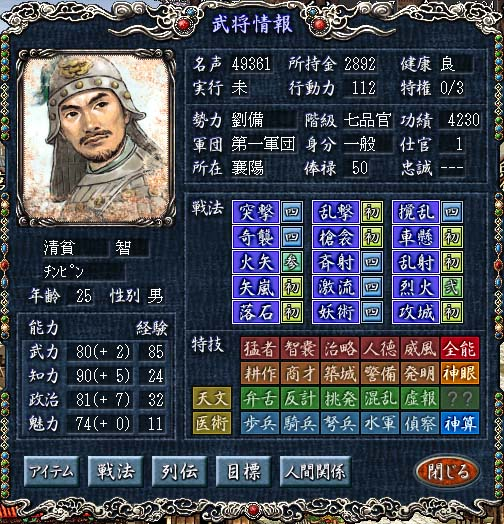

---
title: "いまさら三国志8プレイ記3（194年）"
date: 2011-04-03 22:30:34
category: "ゲーム"
---

<strong><u>194年</u> 孫堅快進撃</strong> （マルチプレイ中）

　

<strong>194年01月</strong>

丁原が弘農のビウ城を陥落させ董ブンを捕らえたため、董氏勢力は完全に滅亡しました。 韓フクがエン州に攻め入りボク陽を制圧し刺史の劉岱は在野に落ちました。

 

　

<a href="https://nyargo1971.github.io/nyargos-blog/">ブログトップ</a> | <a href="http://www4.tokai.or.jp/nyargo/html/ano19.html">エクセルで競馬</a> | <a href="http://www4.tokai.or.jp/nyargo/">本家WEBサイト</a>

