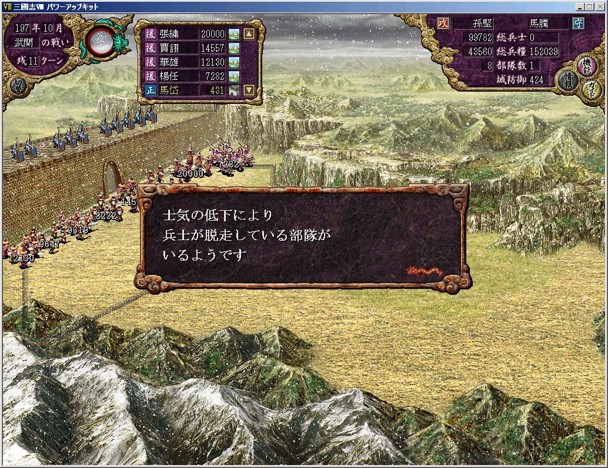

---
title: "いまさら三国志8プレイ記3（197年）"
date: 2011-05-02 21:44:16
category: "ゲーム"
---

<strong><u>197年</u></strong> <strong>孫堅上洛軍</strong> （マルチプレイ中）

　

<strong>197年01月</strong>

劉備が荊南の残る一都市桂陽を制圧し荊南を制覇しました。

 

こうなると士気に開きが出てくる。馬岱だけは冷静で挑発に乗らなかったが、他の将は皆捕らえられており、不安に駆られて兵達が逃げ出し始めた。

正攻法だけでも武関を落とすことは可能であったが、開門を見ずして馬岱の兵は四散し、長安は孫堅のものとなった。

　

<a href="https://nyargo1971.github.io/nyargos-blog/">ブログトップ</a> | <a href="http://www4.tokai.or.jp/nyargo/html/ano19.html">エクセルで競馬</a> | <a href="http://www4.tokai.or.jp/nyargo/">本家WEBサイト</a>

