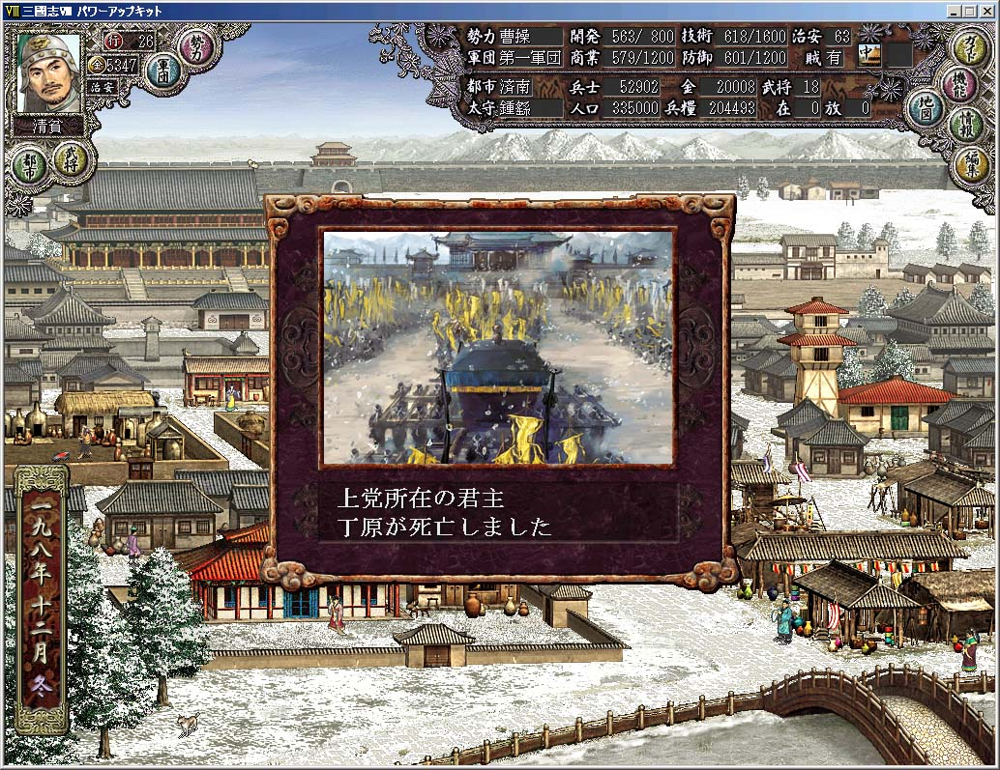

---
title: "いまさら三国志8プレイ記3（198年）"
date: 2011-05-02 22:42:05
category: "ゲーム"
---

<strong><u>198年</u></strong> <strong>孫堅の台頭</strong> （マルチプレイ中）

　

<strong>198年01月</strong>

孫堅が呂布を破って弘農を奪取しました。

 

　

<a href="https://nyargo1971.github.io/nyargos-blog/">ブログトップ</a> | <a href="http://www4.tokai.or.jp/nyargo/html/ano19.html">エクセルで競馬</a> | <a href="http://www4.tokai.or.jp/nyargo/">本家WEBサイト</a>

