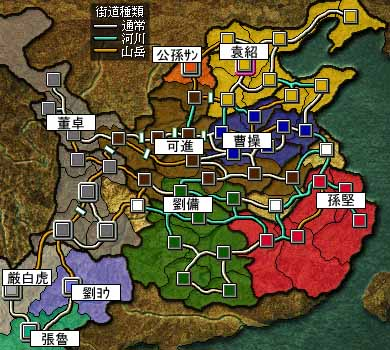

---
title: "三国志８プレイ記３（第二幕）（第１話）"
date: 2012-01-11 18:37:43
category: "ゲーム"
---

※このプレイ記はゲームの進行にあわせて物語を紡いでいます。正史にも演義にもない架空のお話ですからご注意ください。

■<strong>群雄内政に力を注ぎ諸葛亮出廬す（１９２年～１９６年）</strong>

１９２年～１９４年

１９２年

　

●ゲーム的には？

こうして、各勢力がまるで碁盤の目を埋めるように勢力を広げ、緩衝地帯となっていた空白地少なくなっています。

さらには連合が機能しなくなる状況でもあり、各勢力とも内政に地道を上げてはいますが、それは嵐の前の静けさとも言えます。

こういった中、劉備勢力で三国志８をプレイする際に一番のキモとなるイベント年、１９５年を迎えます。

　

<a href="https://nyargo1971.github.io/nyargos-blog/sitemap.md">１９１年←</a> | →<a href="https://nyargo1971.github.io/nyargos-blog/sitemap.md">１９５年</a>

　

<a href="https://nyargo1971.github.io/nyargos-blog/sitemap.md">■黄巾滅ぶも叛乱已まず、群雄連合し賊を討つ（１８７年～１９１年）（シナリオ開始年）</a>
 

<a href="https://nyargo1971.github.io/nyargos-blog/sitemap.md">■群雄内政に力を注ぎ諸葛亮出廬す（１９２年～１９６年）</a>
 

<a href="https://nyargo1971.github.io/nyargos-blog/sitemap.md">■少帝崩御し反董卓連合成る（１９７年）</a>

<a href="https://nyargo1971.github.io/nyargos-blog/sitemap.md">■反董卓連合軍の反撃（１９８年～２０２年）</a>

　

<a href="https://nyargo1971.github.io/nyargos-blog/">ブログトップ</a> | <a href="http://www4.tokai.or.jp/nyargo/html/ano19.html">エクセルで競馬</a> | <a href="http://www4.tokai.or.jp/nyargo/">本家WEBサイト</a>

