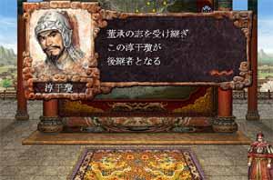

---
title: "三国志８プレイ記３（第三幕）（第１話）"
date: 2012-02-04 11:36:57
category: "ゲーム"
---

※このプレイ記はゲームの進行にあわせて物語を紡いでいます。正史にも演義にもない架空のお話ですからご注意ください。

※最近やたらとページ保存に失敗し、書いた文書が全滅するというショボーンな結果になって、書く気力がすり減っています。

■<strong>少帝崩御し反董卓連合成る（１９７年）</strong>

１９７年　その１（董承の死）

 

この人事はさすがに疑問で、これに荊州新野の劉表が反旗を翻したため、元々劣勢に立っていた朝廷勢力は、ますます縮小した。大将軍にも関わらず、淳ウ瓊の支配地は、エン１都市という始末であった。

　

●ゲーム的には？

後継者争いについて

普通にプレイをしている場合、淳ウ瓊が後継者となるケースなどあり得ません。そもそも遡って可進の後継者に董承が選ばれる事もありません。可進の後釜は王允もしくは名声次第ですが袁紹のいずれかです。

このゲームでは、義兄弟がいた場合、その継承順位はかなり上位になるようです。特に可進のように血胤がいない場合、他の有力者よりも優先される事が多いようです。

さらに複雑なケースでは、このゲーム内でしばしば起こる、董卓の事例で、血族の董ブンではなく義子の牛補が勢力を継ぐ、といった場合など、これにさらに義兄弟が絡んだらどうなるかは、今後の展開でわかってくる事でしょう。（今回のゲーム中では董卓と李儒が、会話により義兄弟になっています。）

　

<a href="https://nyargo1971.github.io/nyargos-blog/sitemap.md">１９６年その２←</a> | →<a href="https://nyargo1971.github.io/nyargos-blog/sitemap.md">１９７年その２</a>

　

<a href="https://nyargo1971.github.io/nyargos-blog/sitemap.md">■黄巾滅ぶも叛乱已まず、群雄連合し賊を討つ（１８７年～１９１年）（シナリオ開始年）</a>
 

<a href="https://nyargo1971.github.io/nyargos-blog/sitemap.md">■群雄内政に力を注ぎ諸葛亮出廬す（１９２年～１９６年）</a>
 

<a href="https://nyargo1971.github.io/nyargos-blog/sitemap.md">■少帝崩御し反董卓連合成る（１９７年）</a>

<a href="https://nyargo1971.github.io/nyargos-blog/sitemap.md">■反董卓連合軍の反撃（１９８年～２０２年）</a>

　

<a href="https://nyargo1971.github.io/nyargos-blog/">ブログトップ</a> | <a href="http://www4.tokai.or.jp/nyargo/html/ano19.html">エクセルで競馬</a> | <a href="http://www4.tokai.or.jp/nyargo/">本家WEBサイト</a>

