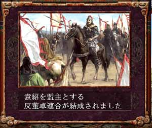

---
title: "三国志８プレイ記３（第三幕）（第２話）"
date: 2012-02-04 16:35:38
category: "ゲーム"
---

※このプレイ記はゲームの進行にあわせて物語を紡いでいます。正史にも演義にもない架空のお話ですからご注意ください。

■<strong>少帝崩御し反董卓連合成る（１９７年）</strong>

１９７年　その２（少帝崩御）

 

こうして、袁紹は反董卓連合の盟主となり、少帝の復讐戦に挑むのであった。

※董卓の名の朱筆とは、すなわち「董卓弑其君」

　

●ゲーム的には？

皇帝や旅人について

ウ吉の処断イベントを除いて、原則プレイヤーが皇帝や旅人を処断したりする事はできません。この月に書かれている「少帝弑殺」ですが、これは私が勝手に書いたものです。

ゲーム解説書によると「少帝が寿命で亡くなるイベント」とされています。少帝はまだ若いのに、そんなことあるでしょうか。

ここでは史実に基づいて、董卓の陰謀に巻き込まれて謀殺されるものとしてイベントを説明しました。

　

<a href="https://nyargo1971.github.io/nyargos-blog/sitemap.md">１９７年その１←</a> | <a href="https://nyargo1971.github.io/nyargos-blog/sitemap.md">→１９７年その３</a>

　

<a href="https://nyargo1971.github.io/nyargos-blog/sitemap.md">■黄巾滅ぶも叛乱已まず、群雄連合し賊を討つ（１８７年～１９１年）（シナリオ開始年）</a>
 

<a href="https://nyargo1971.github.io/nyargos-blog/sitemap.md">■群雄内政に力を注ぎ諸葛亮出廬す（１９２年～１９６年）</a>
 

<a href="https://nyargo1971.github.io/nyargos-blog/sitemap.md">■少帝崩御し反董卓連合成る（１９７年）</a>

<a href="https://nyargo1971.github.io/nyargos-blog/sitemap.md">■反董卓連合軍の反撃（１９８年～２０２年）</a>

　

<a href="https://nyargo1971.github.io/nyargos-blog/">ブログトップ</a> | <a href="http://www4.tokai.or.jp/nyargo/html/ano19.html">エクセルで競馬</a> | <a href="http://www4.tokai.or.jp/nyargo/">本家WEBサイト</a>

