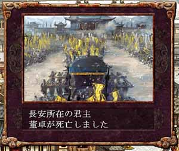

---
title: "三国志８プレイ記３（第四幕）（第４話）"
date: 2012-06-02 16:59:06
category: "ゲーム"
---

※このプレイ記はゲームの進行にあわせて物語を紡いでいます。正史にも演義にもない架空のお話ですからご注意ください。

　

■<strong>反董卓連合軍の反撃（２００年）</strong>

　

２００年　その２（董卓の死）

 

　

<a href="https://nyargo1971.github.io/nyargos-blog/sitemap.md">２００年（その１）←</a> | <a href="https://nyargo1971.github.io/nyargos-blog/2012/06/post-8452.html">→２０１年（その１）

　

<a href="https://nyargo1971.github.io/nyargos-blog/">ブログトップ</a> | <a href="http://www4.tokai.or.jp/nyargo/html/ano19.html">エクセルで競馬</a> | <a href="http://www4.tokai.or.jp/nyargo/">本家WEBサイト</a>

