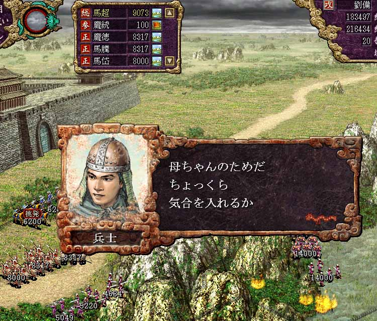

---
title: "三国志８プレイ記３（第四幕）（第７話）"
date: 2012-06-16 17:03:51
category: "ゲーム"
---

※このプレイ記はゲームの進行にあわせて物語を紡いでいます。正史にも演義にもない架空のお話ですからご注意ください。

　

■<strong>反董卓連合軍の反撃（２０２年）</strong>

　

２０２年　劉備の進撃

 

２０２年の侵攻は、これに続くものであった。漢中に趙雲を派遣して長安からの反撃に備える準備をした後、馬氏騎馬軍を武都に進めた。 連合軍の応援もあり、武都は容易に陥落した。

このときすでに朝廷から楚公の爵位を受けて伯となっていた劉備は、趙雲を漢中太守、馬超を武都太守にそれぞれ任命した。 さらに大勢の文官を送り込んで城下の振興策を次々と実施することで、南鄭・武都・下弁など蜀北部漢中地方を完全に掌握する事に成功した。

　

<a href="https://nyargo1971.github.io/nyargos-blog/sitemap.md">２０１年（その２）←</a> | <a href="https://nyargo1971.github.io/nyargos-blog/sitemap.md">→２０３年（その１）</a>

　

<a href="https://nyargo1971.github.io/nyargos-blog/sitemap.md">■黄巾滅ぶも叛乱已まず、群雄連合し賊を討つ（１８７年～１９１年）（シナリオ開始年）</a>
 

<a href="https://nyargo1971.github.io/nyargos-blog/sitemap.md">■群雄内政に力を注ぎ諸葛亮出廬す（１９２年～１９６年）</a>
 

<a href="https://nyargo1971.github.io/nyargos-blog/sitemap.md">■少帝崩御し反董卓連合成る（１９７年）</a>

<a href="https://nyargo1971.github.io/nyargos-blog/sitemap.md">■反董卓連合軍の反撃（１９８年～２０２年）</a>

　

<a href="https://nyargo1971.github.io/nyargos-blog/">ブログトップ</a> | <a href="http://www4.tokai.or.jp/nyargo/html/ano19.html">エクセルで競馬</a> | <a href="http://www4.tokai.or.jp/nyargo/">本家WEBサイト</a>

