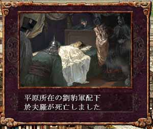

---
title: "三国志８プレイ記３（第五幕）（第７話）"
date: 2012-08-18 15:12:39
category: "ゲーム"
---

※このプレイ記はゲームの進行にあわせて物語を紡いでいます。正史にも演義にもない架空のお話ですからご注意ください。

　

■<strong>董袁衰微し劉孫繁栄す（２０７年）</strong>

　

２０７年　（その２）孫堅北伐行

　

（欄外）また文章が保存されないエラー発生。２時間が無駄に・・・orz

保存されないエラーが起きるのは仕方ないけど、エラーが起きると文章全て消えてしまって、戻っても復旧できずテキスト全滅ってのがキツイです。

　

国力の充実を背景に、孫堅が北伐を決意した。

　

建業の孫策に出師を命じ、自身も呉から前線都市の廬江に本営を移した。 命を受けた孫策はすぐさま出陣、袁術の死後権力の空白地帯となっていた広陵をまずは占拠した。

そして夏、徐州の下ヒで孫曹の勢力がぶつかった。 満を持して精鋭を送り込んだ孫堅軍に対して、曹操は内政重視の体制を取っていたため、徐州には対袁紹の抑え程度の兵士か配備していなかった。 それでも下ヒの総大将は歴戦の徐晃である。彼は劣勢の中よく戦った。

しかし、やはり兵の質量とも開きがありすぎた。孫堅軍は総大将孫策、参軍周ユ以下、呂蒙、徐盛、甘寧、陸孫等が大軍を率いて攻め込んでいるのである。

 

於夫羅が病床にあったため治安が行き届かず、このため劉備に鎮定を依頼したのか、それとも、劉豹が於夫羅派の勢力を削るためにわざと擁州を手放したのか、真相は闇の中です。

　

<a href="https://nyargo1971.github.io/nyargos-blog/sitemap.md">２０７年（その１）←</a> | <a href="https://nyargo1971.github.io/nyargos-blog/sitemap.md">→２１５年【新時代の幕開け】</a>

　

<a href="https://nyargo1971.github.io/nyargos-blog/sitemap.md">■黄巾滅ぶも叛乱已まず、群雄連合し賊を討つ（１８７年～１９１年）（シナリオ開始年）</a>

<a href="https://nyargo1971.github.io/nyargos-blog/sitemap.md">■群雄内政に力を注ぎ諸葛亮出廬す（１９２年～１９６年）</a>

<a href="https://nyargo1971.github.io/nyargos-blog/sitemap.md">■少帝崩御し反董卓連合成る（１９７年）</a>

<a href="https://nyargo1971.github.io/nyargos-blog/sitemap.md">■反董卓連合軍の反撃（１９８年～２０２年）</a>

　

<a href="https://nyargo1971.github.io/nyargos-blog/">ブログトップ</a> | <a href="http://www4.tokai.or.jp/nyargo/html/ano19.html">エクセルで競馬</a> | <a href="http://www4.tokai.or.jp/nyargo/">本家WEBサイト</a>

