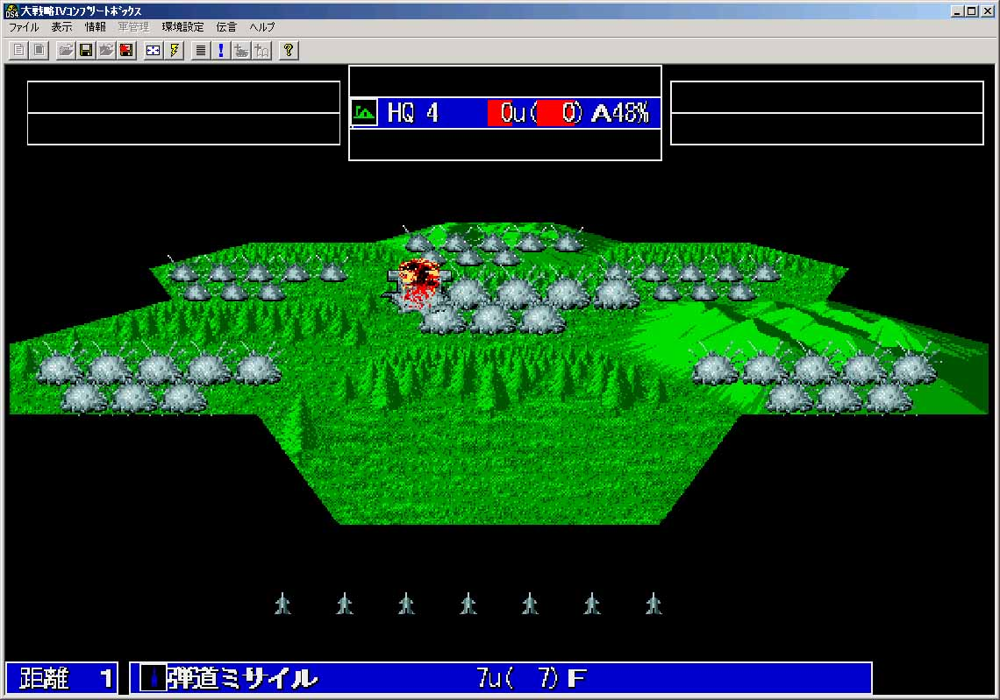

---
title: "RT大戦略４（自衛隊でヴァルキリー）"
date: 2013-01-01 15:15:59
category: "ゲーム"
---

新年明けましておめでとうございます。

正月休みを活用して一気に難マップを攻略し、隠れキャラをゲットしました。

　

■リアルタイム版大戦略の隠れキャラ

１９９０年頃だったと思いますが、リアルタイム版の大戦略が発売されました。 当時は猿のようにプレイしていましたが、追加マップは購入しなかったため、隠れキャラの存在は知りませんでした。

１０年ほど前、廉価版のフルパッケージがあったので、懐かしくなってプレイしているうちに、いつしか全マップをクリアしていました。 そうしたところ（すぐには気づかなかったのですが）、隠しマップが追加されていたり、強力な隠れキャラが開発可能になっていたのです。

 

レベルＡの敵司令部を一撃で破壊する恐ろしさ。

　

<a href="https://nyargo1971.github.io/nyargos-blog/">ブログトップ</a> | <a href="http://www4.tokai.or.jp/nyargo/html/ano19.html">エクセルで競馬</a> | <a href="http://www4.tokai.or.jp/nyargo/">本家WEBサイト</a>

