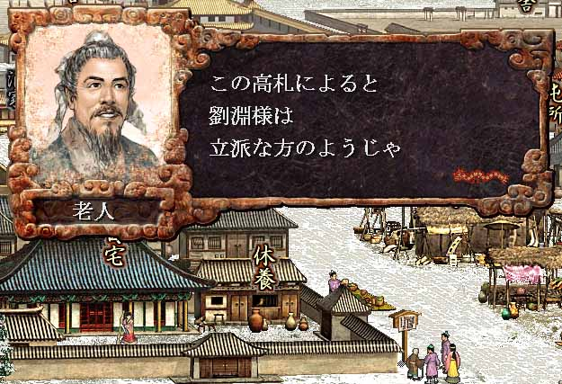

---
title: "三国志８プレイ記３（第六幕）（第３話）"
date: 2013-01-07 00:52:40
category: "ゲーム"
---

※このプレイ記はゲームの進行にあわせて物語を紡いでいます。正史にも演義にもない架空のお話ですからご注意ください。

　

■<strong>劉淵成人し独立す（２１５年）</strong>

　

２１５年　（その３）劉淵涼州制覇

 

　

<a href="https://nyargo1971.github.io/nyargos-blog/sitemap.md">２１５年（その２）←</a> | <a href="https://nyargo1971.github.io/nyargos-blog/sitemap.md">→２１６年</a>

　

<a href="https://nyargo1971.github.io/nyargos-blog/sitemap.md">■黄巾滅ぶも叛乱已まず、群雄連合し賊を討つ（１８７年～１９１年）（シナリオ開始年）</a>

<a href="https://nyargo1971.github.io/nyargos-blog/sitemap.md">■群雄内政に力を注ぎ諸葛亮出廬す（１９２年～１９６年）</a>

<a href="https://nyargo1971.github.io/nyargos-blog/sitemap.md">■少帝崩御し反董卓連合成る（１９７年）</a>

<a href="https://nyargo1971.github.io/nyargos-blog/sitemap.md">■反董卓連合軍の反撃（１９８年～２０２年）</a>

<a href="https://nyargo1971.github.io/nyargos-blog/sitemap.md">■董袁衰微し劉孫繁栄す（２０３年～２０７年）</a>

<a href="https://nyargo1971.github.io/nyargos-blog/sitemap.md">■劉淵成人前夜（２０８年～２１４年）</a>

<a href="https://nyargo1971.github.io/nyargos-blog/sitemap.md">■劉淵立つ（２１５年～）</a>

　

<a href="https://nyargo1971.github.io/nyargos-blog/">ブログトップ</a> | <a href="http://www4.tokai.or.jp/nyargo/html/ano19.html">エクセルで競馬</a> | <a href="http://www4.tokai.or.jp/nyargo/">本家WEBサイト</a>

