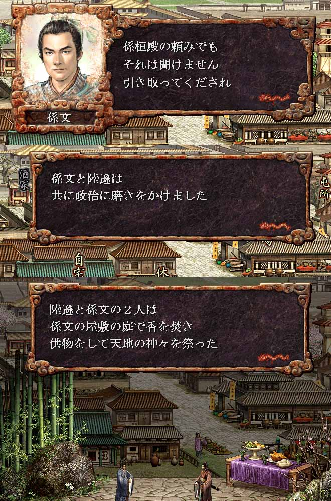

---
title: "三国志８プレイ記３（第六幕）（第５話）"
date: 2013-05-04 10:47:46
category: "ゲーム"
---

※このプレイ記はゲームの進行にあわせて物語を紡いでいます。正史にも演義にもない架空のお話ですからご注意ください。

　

■<strong>劉淵成人し独立す（２１６年）</strong>

　

２１６年　（その２）呉の混乱

　

こうして２１６年は、表立っては呉に混乱の嵐が吹き荒れた年のように見えた。

　

しかし、裏側では次の流れが、静かに始まっていた…。

兆しは劉淵の太守引き抜き策となって現れていたが、まだ当事者達以外は、その流れに気づいてはいなかった。

それは、劉淵の人材登用策の転換であった。

　

<a href="https://nyargo1971.github.io/nyargos-blog/sitemap.md">２１６年（その１）←</a> | <a href="https://nyargo1971.github.io/nyargos-blog/sitemap.md">→２１７年</a>

　

<a href="https://nyargo1971.github.io/nyargos-blog/sitemap.md">■黄巾滅ぶも叛乱已まず、群雄連合し賊を討つ（１８７年～１９１年）（シナリオ開始年）</a>

<a href="https://nyargo1971.github.io/nyargos-blog/sitemap.md">■群雄内政に力を注ぎ諸葛亮出廬す（１９２年～１９６年）</a>

<a href="https://nyargo1971.github.io/nyargos-blog/sitemap.md">■少帝崩御し反董卓連合成る（１９７年）</a>

<a href="https://nyargo1971.github.io/nyargos-blog/sitemap.md">■反董卓連合軍の反撃（１９８年～２０２年）</a>

<a href="https://nyargo1971.github.io/nyargos-blog/sitemap.md">■董袁衰微し劉孫繁栄す（２０３年～２０７年）</a>

<a href="https://nyargo1971.github.io/nyargos-blog/sitemap.md">■劉淵成人前夜（２０８年～２１４年）</a>

<a href="https://nyargo1971.github.io/nyargos-blog/sitemap.md">■劉淵立つ（２１５年～）</a>

　

<a href="https://nyargo1971.github.io/nyargos-blog/">ブログトップ</a> | <a href="http://www4.tokai.or.jp/nyargo/html/ano19.html">エクセルで競馬</a> | <a href="http://www4.tokai.or.jp/nyargo/">本家WEBサイト</a>

